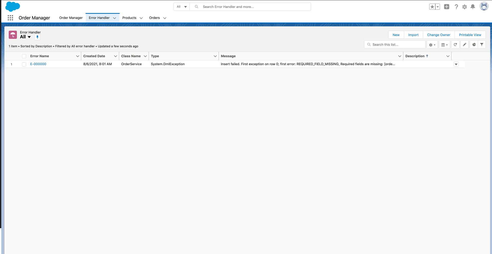

# Salesforce Order Manager

The `Order Manager` Application offers a practical implementation of order management processes are handled in Salesforce. This is an incremental project and the first distribution will focus on Order to Asset process i.e. creating an asset for Order Items when the related Order is complete.

## Distribution

The project will be distributed via Managed Package published in Salesforce Labs.

## How it works

The Order Manager application will create an Asset for each Order Item when the related Order is completed. Order to Asset process will kick off only for Orders that match the filters defined in the Order Mapper metadata record type ( see [Configure the Order Mapper metadata ](#Configure-the-Order-Mapper)). In addition, Asset records will be created only for Order Item whose Product has been previously marked as requiring an Asset ( see [Set Create Asset Field on Products](#Set-Create-Asset-Field-on-Products) ). Field values will be copied from Order Item to Asset record based on the Field Mappeing configuration (see [Configure the Field Mapping metadata ](#Configure-Field-Mapping))

## What to do to make it work
This section lists all the steps required to make sure the application works as expected.

-  [Assign the Order Manager permission set to Admin Users ](#Assign-the-Order-Manager-Permission-Set)
-  [Assign the OM Layouts to Admin Users](#Assign-the-OM-Layout)
-  [Set Create Asset Field on Products](#Set-Create-Asset-Field-on-Products)
-  [Configure the Order Mapper metadata ](#Configure-the-Order-Mapper)
-  [Configure the Field Mapping metadata ](#Configure-Field-Mapping)

### Assign the Order Manager Permission Set

The <strong>Order Manager</strong> Permission Set gives Users access to all the required information to configure the Order Manager application. This can be assigned via the following steps:

<ol>
<li>From Setup, enter Users in the Quick Find box, then select Users.
Select a user. </li>
<li>In the Permission Set Assignments related list, click Edit Assignments.</li>
<li>To assign a permission set, select it under Available Permission Sets and click Add.  </li>
<li>Click Save. </li>
</ol>

### Assign the OM Layout
The following

### Set Create Asset Field on Products
Products for which you expect the application to create an Asset should be marked with the Create Asset field value set to true. This field can be access via the Order Manager Application direclty or via the OM Product Layout.

### Configure the Order Mapper

You need to define which types of Orders will result in Assets created and also which fields will be mapped from Order Item records to the Asset records.

Orders can be filtered via following steps:

<ol>
<li>From Setup, enter <strong>Custom Metadata Types</strong>  in the Quick Find box, then select <strong>Custom Metadata Types</strong>. </li>
<li>In the <strong>Custom Metadata Types</strong> list, seach for <strong>Order Mapper</strong> and then  click on Manage Records.</li>
<li> Change the <strong>Order Status</strong> value if required. This is the value that will be considered to initiate the Order to Asset process and by its default value is Activated. </li>
<li> Add or Change existing filters using the Field Name and Field Value fields. </li>
<li> Click Save. </li>
</ol>

### Configure Field Mapping

This configuration is required to copy values from Order Item to Asset record when the Asset record is created.

This can be defined via the following steps:

<ol>
<li>From Setup, enter <strong>Custom Metadata Types</strong>  in the Quick Find box, then select <strong>Custom Metadata Types</strong>. </li>
<li>In the <strong>Custom Metadata Types</strong> list, search for  <strong>Field Mapping</strong> record and then click on Manage Records.</li>
<li> Add new Field Mapping or Change theexisting ones making sure the Order Mapper lookup field is pointing to the Order to Asset record. </li>
<li> Click Save. </li>
</ol>

## How to monitor while it works

The application behaviour the be monitored in the <strong>Order Manager</strong>  application via the preconfigured Dashboards. Make sure you have been assigned the <strong>Order Manager</strong>  Permission Set, this is requried to access the application.

Exceptions can also be found in the <strong>Error Handler</strong> tab as shown below.

