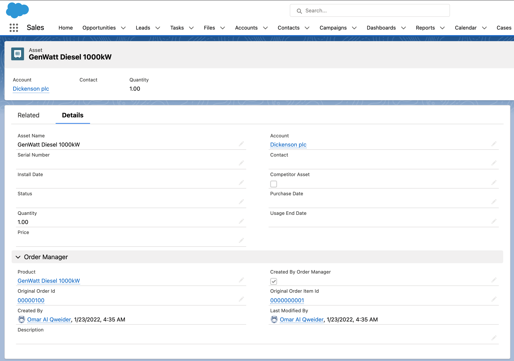
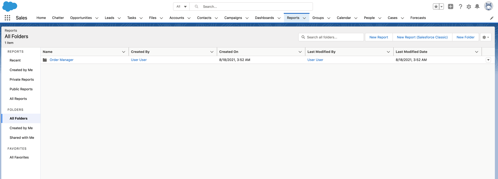

# Salesforce Order Manager

The `Order Manager` Application offers a practical implementation of how order management processes could be handled in Salesforce. This is an incremental project and the first distribution will focus on the Order to Asset process i.e. creating an asset for Order Items when the related Order is completed.

## Distribution

The project will be distributed via Managed Package published in Salesforce Labs.

## How it works

The Order Manager application will create an Asset record for each Order Item when the related Order is completed. `Order to Asset` process will kick off only for Orders that match the filters defined in the Order Mapper metadata record type ( see [Configure the Order Mapper metadata ](#Configure-the-Order-Mapper)). In addition, Asset records will be created only for Order Items where the related Products have been marked as requiring an Asset ( see [Set Create Asset Field on Products](#Set-Create-Asset-Field-on-Products) ). Field values will be copied from the Order Item to the Asset record based on the Field Mapping configuration (see [Configure the Field Mapping metadata ](#Configure-Field-Mapping)). 

The Asset record created by the Order Manager process will store additional information in the `Order Manager` Section e.g. Order which created the asset in the first place. 

## What to do to make it work
This section lists all the steps required to make sure the application works as expected.

-  [Assign the Order Manager permission set to Admin Users and the Order Manager Agent to standard Agents](#Assign-the-Order-Manager-Permission-Set)
-  [Assign the OM Layouts to Admin Users](#Assign-the-OM-Layout)
-  [Set Create Asset Field on Products](#Set-Create-Asset-Field-on-Products)
-  [Configure the Order Mapper metadata ](#Configure-the-Order-Mapper)
-  [Configure the Field Mapping metadata ](#Configure-Field-Mapping)

### Assign the Order Manager Permission Set

The <strong>Order Manager</strong> Permission Set gives Users access to all the required information to configure the Order Manager application, whilst the <strong>Order Manager Agent</strong> Permission Set gives standard users the ability to work with the Order Manager package (e.g. access to Order Manager fields required to correctly create an asset record). The permission sets can be assigned via the following steps:

<ol>
<li>From Setup, enter Users in the Quick Find box, then select Users.
Select a user. </li>
<li>In the Permission Set Assignments related list, click Edit Assignments.</li>
<li>To assign a permission set, select it under Available Permission Sets and click Add.  </li>
<li>Click Save. </li>
</ol>

### Assign the OM Layout
The following new Layouts have been created for the Order Manager app. 
- Product2-OM Product Layout
- Account-OM Account Layout
- Asset-OM Asset Layout

You can assign the layouts following the Salesforce Layout Assignment steps (refer to [Assign Page Layouts from a Customize Page Layout or Record Type Page](https://help.salesforce.com/s/articleView?id=sf.layouts_assigning.htm&type=5 ).

### Set Create Asset Field on Products
Products for which you expect the application to create an Asset should be marked with the Create Asset field value set to true. This field can be accessed via the Order Manager Application direclty or via the OM Product Layout.

### Configure the Order Mapper

`Order Mapper` metadata record type allows you to define which types of Orders will initiate the Asset creation. The following screenshot illustrates an example of Order Mapper which includes two order filters (Type and Description fields) and three field mappings whose values will be copied from the Order Item record to the Asset record once the Asset is created.

Orders can be filtered via following steps:

<ol>
<li>From Setup, enter <strong>Custom Metadata Types</strong>  in the Quick Find box, then select <strong>Custom Metadata Types</strong>. </li>
<li>In the <strong>Custom Metadata Types</strong> list, search for <strong>Order Filter</strong> and then  click on Manage Records.</li>
<li> Click on New and then enter a label, field name (i.e. the field API Name) and field value.</li>
<li> Select the Order Mapper record e.g. the <strong>Order to Asset</strong> record or the appropriate Order Mapper record.</li>
<li> Click Save. </li>
</ol>

Use the following steps if you need change the Order Status that will trigger the Asset process (the default value is Activated).

<ol>
<li>From Setup, enter <strong>Custom Metadata Types</strong>  in the Quick Find box, then select <strong>Custom Metadata Types</strong>. </li>
<li>In the <strong>Custom Metadata Types</strong> list, search for <strong>Order Mapper</strong> and then  click on Manage Records.</li>
<li> Change the <strong>Order Status</strong> value if required. This is the value that will be considered to initiate the Order to Asset process (the default value is Activated) </li>
<li> Click Save. </li>
</ol>

### Configure Field Mapping

This configuration is required to copy values from Order Item to Asset record when the Asset record is created.

This can be defined via the following steps:

<ol>
<li>From Setup, enter <strong>Custom Metadata Types</strong>  in the Quick Find box, then select <strong>Custom Metadata Types</strong>. </li>
<li>In the <strong>Custom Metadata Types</strong> list, search for  <strong>Field Mapping</strong> record and then click on Manage Records.</li>
<li> Add new Field Mapping or Change the existing ones making sure the Order Mapper lookup field is pointing to the correct Order Mapper record e.g. 'Order to Asset' record. </li>
<li> Click Save. </li>
</ol>

## How to monitor while it works

The application behaviour the be monitored in the <strong>Order Manager</strong>  application via the preconfigured Dashboards. Make sure you have been assigned the <strong>Order Manager</strong>  Permission Set, this is required to access the application.

Exceptions can also be found in the <strong>Error Handler</strong> tab as shown below.

## Additional things to consider

<ol>
<li> Users should be assigned to a Profile with Activate Orders permission in order to be able to activate Orders. This is required because of the standard Salesforce behaviour. </li>
<li> If multiple Order Mapper records are applicable to the same Order, then the same Order record will be processed multiple times which could result in multiple Asset records created (which is generally an undesirable behaviour). The best practice is to limit the amount of Order Mapper records and use selective filters to make sure the same order won't be processed by multiple Order Mappers.</li>
<li> In case multiple Order Mappers are required, the best practice is to always keep a field mapping for the Product2 lookup. This is generally an expected behaviour that will result in the Asset-Product reationship. </li>
<li> OM Dashboard and Report folders are shared with AllUsers. If you want to apply a restricted level of access, you'll need to change the folder sharing.</li>
<li> The current distribution incudes already a record called 'Order to Asset' which you can modify accordingly to your requirements. Alternatively you can create more Order Mapper records.  </li>
</ol>

